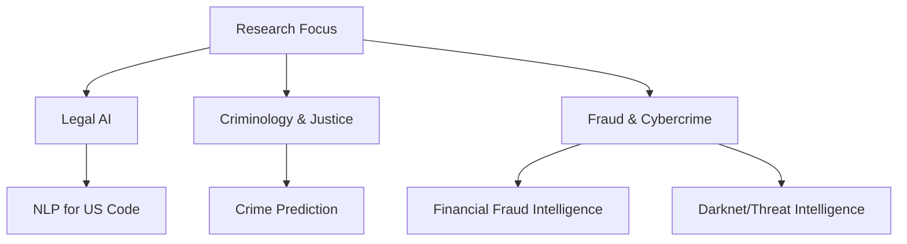
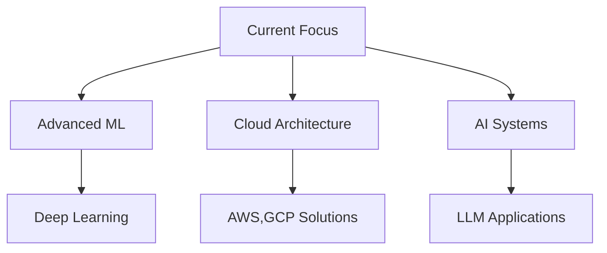

  # <a href="https://manishkolla.com" target="_blank">Manish Kolla</a>

### "Transforming Data into Insights, Code into Solutions" 💡

🎓 **Education and Awards**  
**Georgia State University (Honors)**, Atlanta, GA
- 🎯 Bachelors of Science in Computer Science with Data Science Certificate
- 🥇 Summa Cum Laude (Highest Honors)
- 📊 GPA: 3.99
- 🏆 President's List (5x) & Dean's List (2x)
- 📋 Undergraduate Research Award Nominee
- 👥 President, Indian Student Organization

📚 **Relevant Coursework**  
Data Mining, Artificial Intelligence, Machine Learning, Software Engineering, Database Systems, Linear Algebra, Multivariable Calculus, Data Structures and Algorithms.

## 🔍 Current Areas of Research

🛠️ **Skills**  

**Programming Languages**:  

  

**Frameworks & Tools**:  

**Experienced Roles**:  
- 
- 
- 
- 
- 
- 
- 

👥 **Leadership & Affiliations**  
- **President**: Indian Student Organization (January 2023 - Present)
- **Member**: Mathematical Association of America (MAA), Association for Computing Machinery (ACM)

### Projects

- **Career Wide**: Developed an AI-powered platform for skills-based matching between employers and students using TypeScript, Node.js, Django, Flask, and GenAI. Deployed with Firebase and managed using Agile/Scrum methodologies.
- **Zillow Home Price Prediction**: Applied CRISP-DM and ML algorithms to predict future home prices using historical data and inflation adjustments.
- **GenAI University Chatbot**: Developed a Retrieval-Augmented Generation (RAG) chatbot for a website, streamlining user interaction by providing instant answers, reducing server load, and enhancing user experience beyond traditional navigation.
- **Airline Data Analysis**: Analyzed airport delays using Data Mining and Machine Learning to identify delay patterns and causes.
- **Movie Genre Recognition from Posters**: Created a CNN-based system for classifying movie genres from posters.
- **Multi Threaded Web Crawler**: Developed a multi-threaded web crawler in Java using Jsoup and ExecutorService to efficiently explore and extract data from websites. It ensures only valid, unvisited links are processed and supports resuming from saved states.

## 📚 Current Learning Path

### Hobbies

- 
- 
- 
- 
- 

📊 **GitHub Stats**  

<!--
- 🔭 I’m currently working on ...
- 🌱 I’m currently learning ...
- 👯 I’m looking to collaborate on ...
- 🤔 I’m looking for help with ...
- 💬 Ask me about ...
- 📫 How to reach me: ...
- 😄 Pronouns: ...
- ⚡ Fun fact: ...
-->
